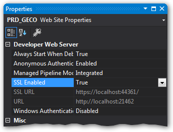
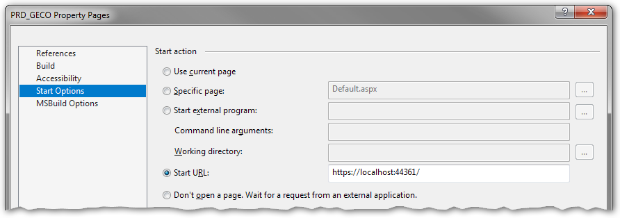

# Georgia Environmental Connections Online (GECO)

## Application

GECO is a Web Forms Application targeting .NET Framework version 4.6.1.

The main components are the Emission Inventory System (EIS), Emission Fees, Emission Statement, and Event Registration.

## Prerequisites for developing

+ [Visual Studio](https://www.visualstudio.com/)

+ SAP Crystal Reports, developer version for Microsoft Visual Studio is required if one of the Crystal Reports documents needs to be edited.

How to enable HTTPS debugging mode in Visual Studio:

* Select the PRD_GECO project in the Solution Explorer and select View → Properties Window (F4).  
* Set "SSL Enabled" to True.  
* Copy the SSL URL (port numbers may differ).
* Select View → Property Pages (Shift+F4).
* Under Start Options, choose "Start URL" and paste the SSL URL.  
